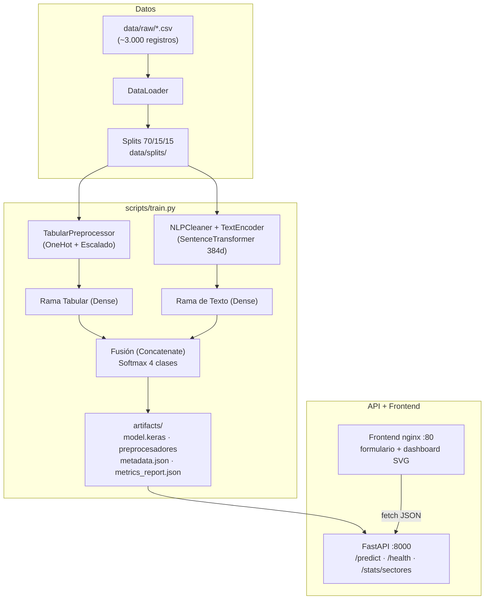

# SIAE — Sistema Inteligente de Autodiagnóstico Empresarial (Proyecto ITACA)

Motor de IA multimodal híbrido (**TensorFlow/Keras + SentenceTransformers**) para el
autodiagnóstico de madurez digital de empresas, con API REST (FastAPI), cliente web
interactivo con dashboard comparativo por sector, y orquestación completa con Docker.

---

## Objetivos SMART

| # | Objetivo | Métrica | Meta | Plazo |
|---|----------|---------|------|-------|
| 1 | Clasificar el nivel de madurez digital en 4 clases | Accuracy en test | ≥ 85% | Cierre del proyecto |
| 2 | Garantizar desempeño balanceado entre clases | F1-macro en test | ≥ 0.80 | Cierre del proyecto |
| 3 | Asegurar equidad entre sectores industriales | Δ F1 máx. entre sectores | ≤ 5% | Cada entrenamiento |
| 4 | Responder diagnósticos en tiempo interactivo | Latencia de inferencia (caliente) | < 3 s | Cada release |
| 5 | Entrega reproducible por terceros | `docker compose up` funcional end-to-end | 100% | Entrega final |

> **Nota de transparencia:** las métricas actuales del modelo (accuracy = 1.0) están
> infladas por limitaciones del dataset sintético (ver
> [Informe Técnico](docs/Informe_Tecnico.md), sección *Resultados*). El pipeline de
> auditoría (`scripts/diagnostico_fuga.py`, `scripts/ablacion_solo_texto.py`) documenta
> este hallazgo de forma reproducible.

---

## Diagrama de Arquitectura



---

## Instalación y Uso

Requisitos: **Python 3.11+** (o Docker). Desde la raíz del repositorio:

### 1. Instalar dependencias

```bash
pip install -r requirements.txt
pip install -e .
```

### 2. Entrenar el modelo (genera todos los artefactos)

```bash
python scripts/train.py
```

Produce en `artifacts/`: `model.keras`, `tabular_preprocessor.joblib`,
`label_encoder.joblib`, `metadata.json` y `metrics_report.json`.

### 3. Levantar la API

```bash
python scripts/serve.py
```

API disponible en `http://localhost:8000` (documentación interactiva en `/docs`).

### 4. Probar inferencia por CLI

```bash
python scripts/predict.py
```

### 5. Ejecutar la suite de pruebas

```bash
pytest tests/
```

### Scripts de auditoría y diagnóstico

```bash
python scripts/evaluate.py            # Métricas + auditoría de equidad en test
python scripts/medir_latencia.py      # Benchmark de latencia (< 3 s)
python scripts/diagnostico_fuga.py    # Detección de fuga en variable numérica
python scripts/ablacion_solo_texto.py # Ablación: rendimiento usando solo texto
```

---

## Docker (demo completa)

```bash
cd docker
docker compose up --build
```

| Servicio | URL | Descripción |
|----------|-----|-------------|
| API REST | `http://localhost:8000` | FastAPI con healthcheck |
| Frontend | `http://localhost:80` | Cliente web + dashboard comparativo |

El frontend espera a que la API esté saludable (`condition: service_healthy`)
antes de arrancar, garantizando que el modelo ya está cargado en memoria.

---

## Payloads de Ejemplo

### `POST /predict`

```json
{
  "sector": "Tecnología",
  "tamano_empresa": "Micro",
  "porcentaje_procesos_documentados": 0.05,
  "presupuesto_anual_tecnología": 3000000,
  "respuesta_texto": "El trabajo es muy empírico, no hay documentación de lo que hacemos."
}
```

Respuesta:

```json
{
  "status": "SUCCESS",
  "nivel_madurez": "Inicial",
  "confidence_score": 0.98,
  "probabilities": {
    "Definido": 0.0, "En Desarrollo": 0.01, "Inicial": 0.98, "Optimizado": 0.0
  },
  "recomendacion_principal": "Mapear flujos de trabajo de desarrollo y usar repositorios de código centralizados."
}
```

Casos adicionales listos para la demo (disponibles como botones en el frontend):

```json
{
  "sector": "Comercio",
  "tamano_empresa": "Pequeña",
  "porcentaje_procesos_documentados": 0.35,
  "presupuesto_anual_tecnología": 8000000,
  "respuesta_texto": "Tenemos algunas herramientas digitales pero no están integradas."
}
```

```json
{
  "sector": "Tecnología",
  "tamano_empresa": "Grande",
  "porcentaje_procesos_documentados": 0.92,
  "presupuesto_anual_tecnología": 250000000,
  "respuesta_texto": "Automatizamos el ciclo completo y medimos todo con tableros de control."
}
```

### `GET /stats/sectores`

Devuelve la distribución de madurez por sector usada por el dashboard
(conteos, porcentajes y mediana de presupuesto de 3.000 empresas de referencia).

### `GET /health`

```json
{ "status": "ONLINE", "artifacts_loaded": true }
```

---

## Estructura del Repositorio

- `src/` — Código fuente: `data_loader/`, `preprocessing/` (tabular y texto),
  `models/` (modelo híbrido multi-input), `evaluation/` (auditor de equidad),
  `api/` (FastAPI + agregación sectorial), `utils/`.
- `scripts/` — CLI de entrenamiento, evaluación, inferencia, servidor y auditorías.
- `frontend/` — Cliente web (HTML/CSS/JS vanilla, gráficas SVG sin dependencias).
- `docker/` — `Dockerfile.api`, `Dockerfile.frontend`, `docker-compose.yml`.
- `notebooks/` — EDA, preprocesamiento y evaluación.
- `tests/` — Suite `pytest` (API, datos, modelos, preprocesamiento, evaluación).
- `data/` — Crudos, procesados y particiones (las particiones se regeneran).
- `artifacts/` — Modelo serializado, preprocesadores y reportes automatizados.
- `docs/` — [Informe Técnico](docs/Informe_Tecnico.md) del proyecto.

---

## Documentación

- **[Informe Técnico](docs/Informe_Tecnico.md)** — problema, arquitectura,
  metodología, análisis ético (PII, equidad, XAI) y resultados con análisis
  crítico de fugas de datos.
- `artifacts/metrics_report.json` — accuracy, F1-macro y auditoría de equidad.
- `artifacts/metadata.json` — modelo NLP, fecha de entrenamiento, versión y
  dimensiones de embedding.
